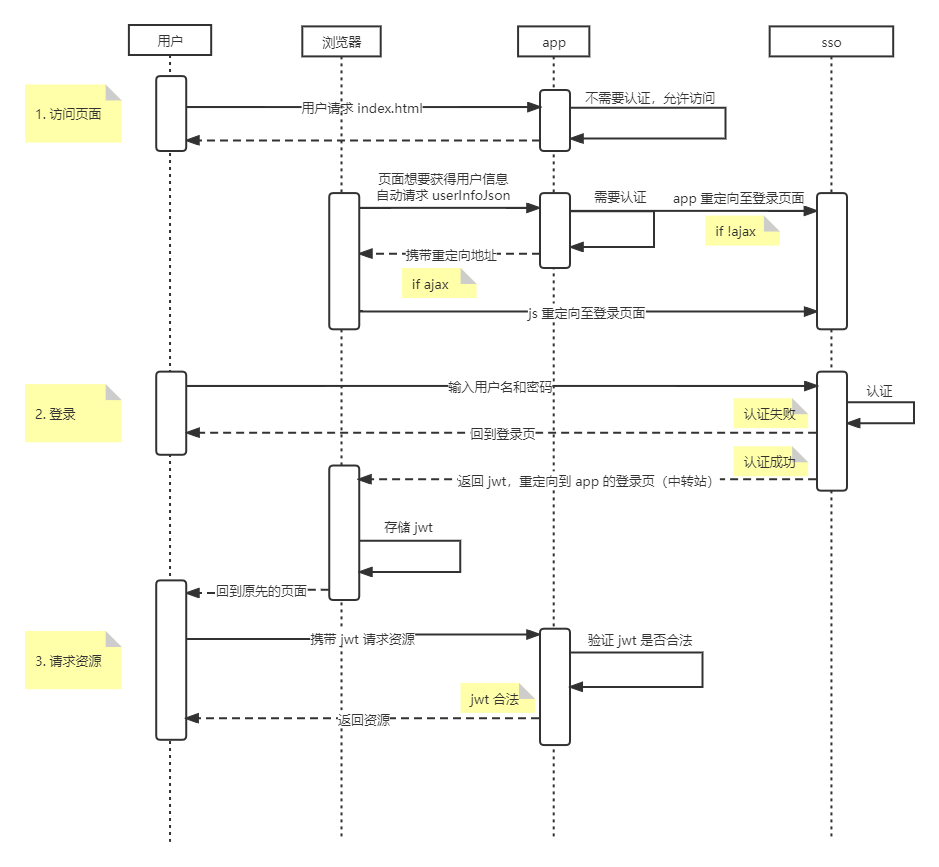
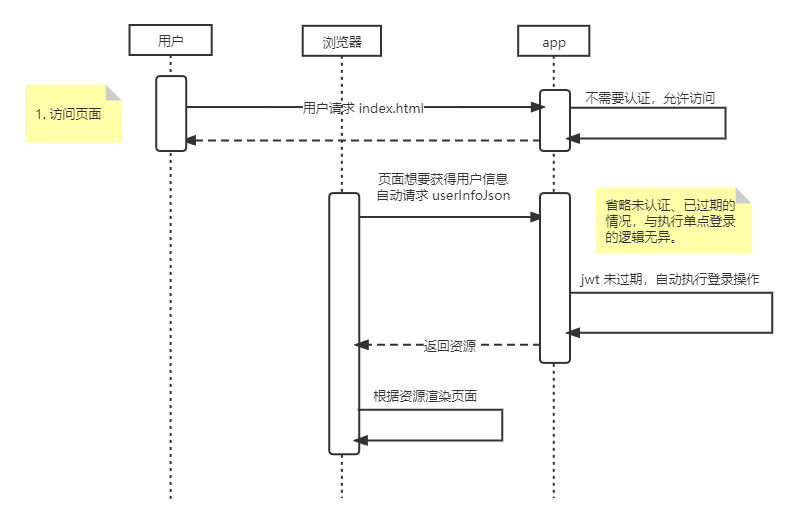
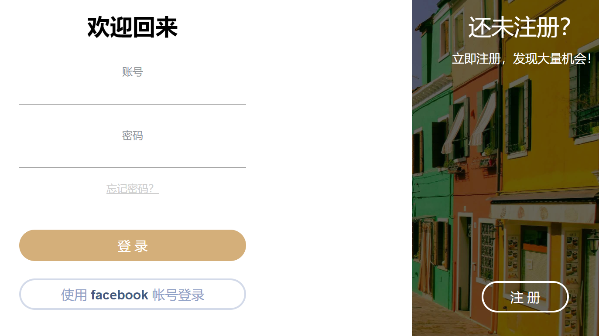
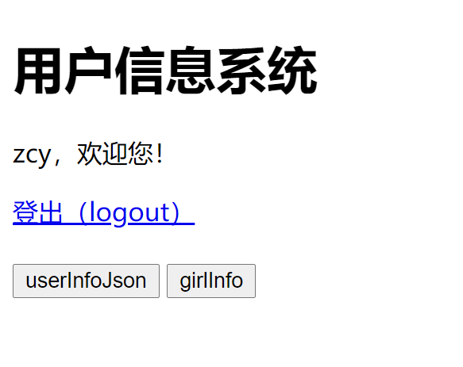

## todo
- [ ] 根据 [JWT 文档](https://datatracker.ietf.org/doc/html/rfc7519) 严格执行判断无效令牌的逻辑

## 特性
1. 使用 [shiro](https://shiro.apache.org/) 作为认证框架。
2. 利用 [jwt](https://jwt.io/) 实现单点登录功能。
3. shiro-jwt-sso 作为无状态服务器。
4. shiro-jwt-app 作为有状态服务器，存储用户的 jwt。
5. 利用 shiro 新特性，100 行代码实现 shiro-jwt 逻辑。（相对于网络上其它教程，具有更简单的逻辑）

## 你需要哪些前置知识
1. [SpringMVC](https://docs.spring.io/spring-framework/docs/current/reference/html/web.html) `@Controller` 以及 `@RestController`
2. [Spring Boot](https://spring.io/projects/spring-boot)
3. [shiro](https://shiro.apache.org/) 基本操作
4. [jwt](https://jwt.io/) 基本概念
5. 了解什么是跨域

## 用户请求时序图

### 用户未登录执行单点登录


### JWTFilter
代办

### 用户已登录app意外重启


## 如何使用
1. 启动 shiro-jwt-sso (8080) 和 shiro-jwt-app (8081)，目前无先后顺序之分。
2. 访问 http://localhost:8081/index.html

## 预期结果
1. 访问 http://localhost:8081/index.html 
2. 由于上述链接请求了用户信息，因此访问被拒绝并跳转到 http://localhost:8080/login.html?loginUrl=http://localhost:8081/login.html&backUrl=http://localhost:8081/index.html&aud=shiro-jwt-app  

3. 输入用户名密码后，直接重定向回 http://localhost:8081/index.html  

4. 点击 girlInfo 按钮，跳转到未授权页面。
5. 过几分钟后，jwt 失效。按 F5 刷新，又被重定向到 sso。

## 程序代码示例
该项目可能会更新。以下代码仅用于参考，并非真实代码，直接使用甚至会报错。

### 单点登录系统
单点登录系统与普通的登录系统没有什么区别。

1. 配置 shiro，所有请求都需要认证。
```java
@Configuration
public class ShiroConfig {
    @Bean
    public ShiroFilterChainDefinition shiroFilterChainDefinition() {
        DefaultShiroFilterChainDefinition chainDefinition = new DefaultShiroFilterChainDefinition();
        chainDefinition.addPathDefinition("/login", "anon");
        chainDefinition.addPathDefinition("/**", "authc");
        return chainDefinition;
    }
}
```
2. 创建 jwt 工具类，用于签发令牌。
3. 创建登录控制器。
```java
@Controller
public class LoginController {
    @RequestMapping("/login.html")
    public ModelAndView showLogin(String loginUrl, String backUrl, String aud){
        Map<String, String> map = new HashMap<>();
        map.put("backUrl", backUrl);
        map.put("loginUrl", loginUrl);
        map.put("aud", aud);
        return new ModelAndView("login", map);
    }

    @PostMapping("/login")
    @ResponseBody
    public String login(
            String account, String password,
            String loginUrl, String backUrl, String aud,
            HttpServletResponse resp
    ) throws IOException {
        // 1. 登录
        Subject subject = SecurityUtils.getSubject();
        UsernamePasswordToken token = new UsernamePasswordToken(account, password);
        subject.login(token);

        // 2. 签发 jwt
        final Object principal = subject.getPrincipal();
        String username;
        if (principal instanceof String){
            username = (String) principal;
        }else{
            username = "default name";
        }
        final String jwt = JwtUtil.sign(username, "17712345678", aud);

        // 3. 重定向回用户访问的链接
        String redirectUrl = loginUrl + "?backUrl=" + backUrl + "&authorization=" + jwt;
        resp.sendRedirect(redirectUrl);
        return "login success";
    }
}
```
4. 配置跨域
```java
@Configuration
public class CorsConfig implements WebMvcConfigurer {
    // 模拟从数据库得到域名
    String[] ORIGINS = {"http://localhost:8081"};
    @Override
    public void addCorsMappings(CorsRegistry registry) {
        // 只允许跨域重定向至本系统的登录页面
        registry.addMapping("/login.html")
                //允许远端访问的域名
                .allowedOrigins(ORIGINS)
                //允许请求的方法
                .allowedMethods("GET");
    }
}
```
5. ini 配置
```ini
[users]
zcy = 123
;tom = 123
```

### 应用系统
应用系统具有略复杂的逻辑，主要在于它需要拦截用户请求、判断 jwt 是否过期、重定向至 sso。

1. 配置 shiro，只拦截需要认证的请求。
```java
@Configuration
public class ShiroConfig {
    @Bean
    public ShiroFilterChainDefinition shiroFilterChainDefinition() {
        DefaultShiroFilterChainDefinition chainDefinition = new DefaultShiroFilterChainDefinition();
        chainDefinition.addPathDefinition("/user/**", "jwtFilter");
        return chainDefinition;
    }
}
```
2. 创建 jwt 工具类，用于验证令牌。
3. 创建资源控制器。
```java
@Controller
public class UserController {

    @RequestMapping("/user/userInfoJson")
    @ResponseBody
    public UserInfo getUserInfo(HttpServletRequest req, HttpServletResponse resp) {
        Subject subject = SecurityUtils.getSubject();
        final String principal = (String) subject.getPrincipal();
        final DecodedJWT decodedJWT = JwtUtil.decode(principal);
        return new UserInfo(
                decodedJWT.getClaim("username").asString(),
                decodedJWT.getSubject()
        );
    }

    @RequiresRoles("boyfriend")
    @RequestMapping("/user/girlInfo")
    @ResponseBody
    public UserInfo getGirlInfo(){
        return new UserInfo("小红", "xxxxxx");
    }

    @GetMapping("/logout")
    public String logout(){
        Subject subject = SecurityUtils.getSubject();
        subject.logout();
        return "redirect:logout.html";
    }

}
```
4. 创建拦截器，拦截所有需要 jwt 认证的请求。大概 40 行主要代码。
```java
public class JWTFilter extends BearerHttpAuthenticationFilter {

    public static final String CALLBACK_LOGIN_URL = "http://localhost:8081/login.html";
    public static final String INDEX_URL = "http://localhost:8081/index.html";
    public static final String LOGOUT_URL = "logout";

    @Override
    protected boolean isAccessAllowed(ServletRequest request, ServletResponse response, Object mappedValue) {
        final AuthenticationToken token = createToken(request, response);
        final String jwt = (String) token.getCredentials();
        // 考虑到 jwt 过期与用户未认证二者的逻辑是一样的，所以过期以及解码失败都返回 false，不允许访问
        try {
            if (JwtUtil.isExpire(jwt)) {
                return false;
            }
        } catch (JWTDecodeException e) {
            return false;
        }
        return super.isAccessAllowed(request, response, mappedValue);
    }

    @Override
    protected boolean onAccessDenied(ServletRequest request, ServletResponse response) throws Exception {
        boolean loggedIn = false;
        if (isLoginAttempt(request, response)) {
            loggedIn = executeLogin(request, response);
        }
        if (!loggedIn) {
            getSubject(request, response).logout();

            final HttpServletRequest httpServletRequest = (HttpServletRequest) request;
            final HttpServletResponse httpServletResponse = (HttpServletResponse) response;
            // 如果是 ajax 请求
            if ("XMLHttpRequest".equals(httpServletRequest.getHeader("X-Requested-With"))) {
                httpServletResponse.setHeader("redirect", this.getRedirectUrl(request, response));
                httpServletResponse.setStatus(HttpServletResponse.SC_TEMPORARY_REDIRECT);
                return false;
            }

            redirectToLogin(request, response);
        }
        return loggedIn;
    }
}
```
5. 创建 `JWTRealm` 用于 jwt 认证。大概 30 行代码。
```java
public class JWTRealm extends AuthenticatingRealm {

    @Override
    public boolean supports(AuthenticationToken token) {
        return token instanceof BearerToken;
    }

    @Override
    protected AuthenticationInfo doGetAuthenticationInfo(AuthenticationToken token) throws AuthenticationException {
        final BearerToken bearerToken = (BearerToken) token;
        final String jwt = bearerToken.getToken();
        boolean verified = false;
        try {
            verified = JwtUtil.verify(jwt);
        } catch (UnsupportedEncodingException e) {
            e.printStackTrace();
        }
        JwtUtil.decode(jwt);
        if (verified) {
            return new SimpleAccount(jwt, token.getCredentials(), getName());
        }else{
            return new SimpleAccount(jwt, "", getName());
        }
    }
}
```
6. ini 配置
```ini
[users]
; 无视密码，ini 必要的格式
zcy = xxx, boyfriend
[roles]
boyfriend = ask:*
```

## 问答
**sso 没有授权功能吗？**sso 是单点登录系统，目前的想法是 sso 只做登录，授权交给 app 实现。

**为什么 app 也没有授权功能？？**因为采用了 InI 配置。InIRealm 会根据用户名（`principal`）获取用户的权限。
但是本系统中，`principal` 和 `credentials` 都是 jwt，用户名藏在 jwt 里。虽然可以写一些简单的代码实现上述功能，但是太懒了-_-!

## 排坑指南
这里记录了在编写代码时遇到的坑。详见博客。

